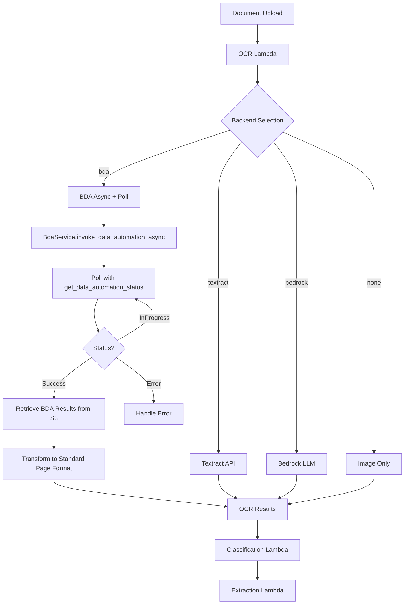
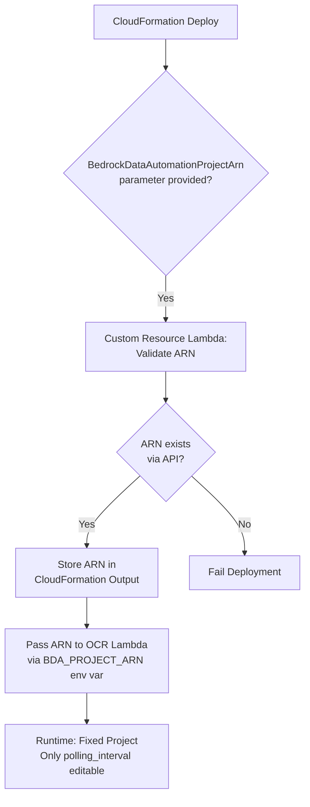
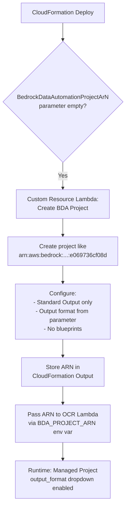
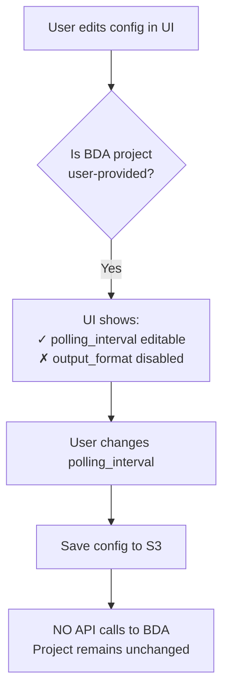
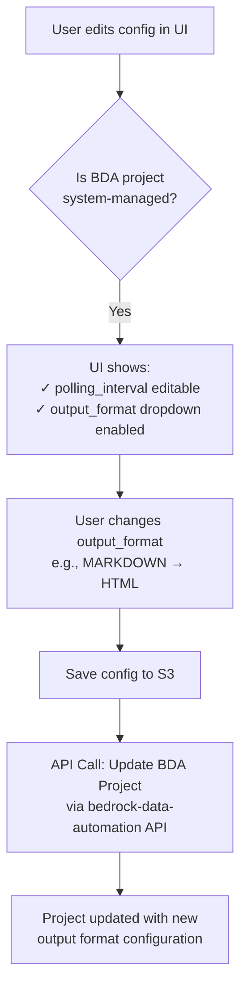

# GenAI IDP Accelerator - Active Context

## Current Task Status

**BDA OCR Integration for Pattern 2 & 3**: 🚧 **IN PROGRESS** - Phase 1: Core BDA Backend Implementation

**Previous Tasks**: 
- ✅ **COMPLETED** - ProcessChanges Resolver Fix & Agent Analytics Optimization
- ✅ **COMPLETED** - Section Edit Mode Performance Optimization  
- ✅ **COMPLETED** - IDP CLI Dependency Security Updates
- ✅ **COMPLETED** - Service Principal GovCloud Compatibility Updates

## BDA OCR Integration Overview

Adding Bedrock Data Automation (BDA) as a new OCR backend option for Pattern 2 and Pattern 3, enabling users to choose between Textract, Bedrock Vision, BDA, or no OCR processing.

### **Key Design Decisions**

1. **Polling Framework Inside OCR Lambda**
   - BDA async invocation with synchronous polling within Lambda
   - Average 30 sec/doc, 500+ pages ~2-5 min (well under 15-min Lambda timeout)
   - Default polling interval: 10 seconds (configurable via `polling_interval` parameter)
   - Simpler than EventBridge integration, consistent with current bedrock backend

2. **BDA Project Configuration**
   - Standard Output (OCR-only) - no custom blueprints for faster, cheaper processing
   - **Supports 3 text output formats: MARKDOWN (default), HTML, PLAIN_TEXT**
   - **CSV NOT SUPPORTED** - requires element-level extraction, not page-level text
   - Document-level processing (not full IDP like Pattern 1)
   - Optional custom project ARN or auto-create default project

3. **Configuration Extension**
   - New `BDAConfig` model with `output_format` (MARKDOWN/HTML/PLAIN_TEXT) and `polling_interval`
   - Added to `OCRConfig` as optional field (required when backend="bda")
   - UI dropdown for backend selection with BDA-specific options

### **Implementation Phases**

#### **Phase 1: Core BDA Integration in idp_common** ✅ READY TO START
- Extend `OCRConfig` in `lib/idp_common_pkg/idp_common/config/models.py`
  - Add `BDAConfig` model with output format options
  - Add `bda: Optional[BDAConfig]` to `OCRConfig`
  - Validate BDA config when backend="bda"

- Update `OcrService` in `lib/idp_common_pkg/idp_common/ocr/service.py`
  - Add backend validation to include "bda"
  - Implement `_process_document_bda()` method
  - Implement `_poll_bda_status()` helper
  - Implement `_transform_bda_results()` to convert BDA output to standard Page format
  - Add metering for BDA operations

**Key Methods to Add:**
```python
def _process_document_bda(self, document: Document) -> Document:
    """Process document using BDA backend"""
    # 1. Initialize BdaService
    # 2. Invoke async
    # 3. Poll for completion
    # 4. Transform results
    # 5. Return updated document

def _poll_bda_status(self, invocation_arn: str) -> Dict:
    """Poll BDA job status until completion"""
    # Uses self.config.ocr.bda.polling_interval

def _transform_bda_results(self, bda_output_s3_uri: str, document: Document) -> Document:
    """Transform BDA S3 output to standard Page objects"""
    # Reads BDA JSON from S3
    # Creates Page objects with proper URIs
    # Handles different output formats
```

#### **Phase 1.5: Testing with Notebook** 📝 NEXT AFTER PHASE 1
- Update `notebooks/examples/step1_ocr.ipynb` to test both Textract and BDA
- Compare processing times and output quality
- Validate BDA output format compatibility
- Document performance benchmarks

#### **Phase 2: CloudFormation Template Updates**
- Update `patterns/pattern-2/template.yaml`
  - Add `BDAProjectArn` parameter (optional)
  - Update `UpdateDefaultSchemaFunction` environment variables
  - Add BDA options to default schema

- Update `patterns/pattern-3/template.yaml` (same changes as Pattern 2)

- UpdateDefaultSchema Lambda
  - Add BDA options to default schema JSON
  - Include output format dropdown
  - Add BDA project ARN field (optional)

#### **Phase 3: UI Integration**
- Add OCR Backend dropdown to configuration UI
- Add BDA-specific configuration fields:
  - Output Format (MARKDOWN, PLAIN_TEXT, HTML, CSV)
  - BDA Project ARN (optional)
  - Enable Document Splitting toggle
- Update configuration validation

#### **Phase 4: Testing & Documentation**
- Create comprehensive unit tests
- Create integration tests
- Performance benchmarks (especially 500+ page documents)
- Cost analysis (BDA vs Textract)
- Update documentation

### **Architecture Diagram**



### **BDA Output Format Handling**

All BDA output formats convert to standard `Page` structure for compatibility:
- **MARKDOWN**: Text with structure indicators (default, best for downstream)
- **PLAIN_TEXT**: Unformatted text only
- **HTML**: Text with HTML semantic tags
- **CSV**: Tables as CSV files + text content

Key features:
- All formats populate `Page.parsed_text_uri`
- Bounding boxes included for assessment module
- Raw BDA response stored as `Page.raw_text_uri` for debugging
- Compatible with existing Classification & Extraction modules

### **Risk Mitigation**

1. **Lambda Timeout**: BDA timing (30 sec avg) provides safe margin under 15-min limit
2. **Cost Differences**: Document cost clearly ($0.040/page BDA vs $0.0001/page Textract detect_text)
3. **Output Compatibility**: Transform all formats to standard Page structure with extensive tests
4. **Project Management**: Support both custom ARN and auto-create default project

### **Current Implementation Status**

#### Phase 1: Core BDA Integration ✅ COMPLETED
- [x] Update config models (`lib/idp_common_pkg/idp_common/config/models.py`)
  - Added `BDAOutputFormat` enum (PLAIN_TEXT, MARKDOWN, HTML, CSV)
  - Added `BDAConfig` model with project_arn, output_format, polling_interval
  - Extended `OCRConfig` with `bda: Optional[BDAConfig]` field
  - Added backend validation for "bda"
- [x] Implement BDA backend in OCR service (`lib/idp_common_pkg/idp_common/ocr/service.py`)
  - Added backend="bda" routing in `process_document()`
  - Implemented `_process_document_bda()` - main BDA processing method
  - Implemented `_poll_bda_status()` - status polling with 14.5-min timeout protection
  - Implemented `_transform_bda_results()` - transforms BDA output to Page objects
  - Implemented `_generate_bda_confidence_data()` - converts bounding boxes to markdown
  - Integrated with existing BdaService from Pattern 1
- [x] Created test script (`notebooks/examples/step1_ocr_test.py`)
  - Compares Textract vs BDA processing time
  - Saves results to `temp-testing-outputs/` directory
  - Outputs detailed timing comparison
- [ ] 🚧 **BLOCKED**: Test execution (venv/import issues)
  - Script created but encountering ModuleNotFoundError for idp_common
  - Package installed in .venv but Python can't find it when running script
  - Need to resolve Python path/import configuration

**Resolution:**
- ✅ Fixed import issues by adding direct sys.path manipulation to script
- ✅ All OCR dependencies installed successfully
- ✅ Script now imports idp_common from local codebase correctly

### Phase 1 Test Results ✅ SUCCESS

**BDA Page-Level Transformation Fixed:**
- **Problem**: BDA output structure didn't match expected `document.pages` format
- **Root Cause**: BDA returns `job_metadata.json` with pointers to segment result files
  - Each segment has `result.json` with pages array at TOP LEVEL (not under `document.pages`)
  - Text is in `page["representation"]["html"]` format
- **Solution**: Completely rewrote `_transform_bda_results()` to:
  - Read job metadata and extract all segment result file paths
  - Download and parse each segment's result.json
  - Extract pages from top-level "pages" array
  - Map HTML text from `representation["html"]` to Page objects
  - Save parsed text, raw text, and confidence data to S3

**Test Execution Results:**
```
📊 Processing Time:
   Textract: 3.15 seconds (6 pages)
   BDA:      17.44 seconds (6 pages)
   Textract was 14.29s (81.9%) faster

✅ Status:
   Textract: COMPLETED
   BDA:      COMPLETED

Output Files:
- temp-testing-outputs/textract/
  - document.json (Status: COMPLETED)
  - page_1_parsed.json through page_6_parsed.json (all with extracted text)
- temp-testing-outputs/bda/
  - document.json (Status: COMPLETED)  
  - page_1_parsed.json through page_6_parsed.json (all with HTML text)
```

**Key Improvements to Test Script:**
- ✅ Automatic cleanup of `temp-testing-outputs/` at script start
- ✅ Separate document objects for each test (prevents cross-contamination)
- ✅ Status correctly updated (COMPLETED/FAILED) before saving
- ✅ BDA polling: 5 seconds interval, 15 minutes (900s) timeout
- ✅ Saves parsed text for each page from both backends

**BDA Configuration Used:**
```python
{
  "ocr": {
    "backend": "bda",
    "bda": {
      "output_format": "MARKDOWN",
      "polling_interval": 5,  # 5 seconds
      "timeout": 900  # 15 minutes
    }
  }
}
```

**Phase 1 Status: ✅ COMPLETE AND VALIDATED**
- All core BDA backend functionality working
- Page-level transformation correctly implemented
- Both Textract and BDA producing valid outputs
- Ready to proceed to Phase 2

#### Phase 2: CloudFormation Templates ✅ COMPLETED
- [x] Update Pattern 2 template - Fixed BDA configuration schema
- [x] Update Pattern 3 template - Fixed BDA configuration schema
- [x] Remove project_arn from runtime config (deploy-time only)
- [x] Remove enable_splitting toggle (dead code)
- [x] Make output_format conditional via CloudFormation !If

**Changes Applied:**
```yaml
# Before (incorrect - all fields visible at runtime)
bda:
  properties:
    project_arn: string        # ❌ Should not be runtime editable
    output_format: enum        # ❌ Should be conditional
    enable_splitting: boolean  # ❌ Dead code
    polling_interval: integer  # ✅ Correct

# After (correct - conditional based on deployment)
bda:
  properties:
    output_format:             # Conditionally included
      !If
        - HasBDAProjectArn     # If custom ARN at deploy
        - !Ref AWS::NoValue    # Then exclude field
        - type: string         # Else include field
          enum: ["MARKDOWN", "HTML", "PLAIN_TEXT"]
    polling_interval: integer  # ✅ Always editable
```

**How It Works:**
- Uses existing CloudFormation `!If` pattern (same as custom model ARNs)
- When custom BDA ARN provided at deploy → `output_format` excluded from schema
- When no BDA ARN at deploy → `output_format` included as editable dropdown
- `polling_interval` always editable regardless of project type

**Files Modified:**
- `patterns/pattern-2/template.yaml` - BDA schema in UpdateSchemaConfig resource
- `patterns/pattern-3/template.yaml` - Same changes as Pattern 2

**UI Behavior (via existing ConfigBuilder framework):**
- Custom Project (ARN at deploy) → Shows only `polling_interval`
- Managed Project (no ARN at deploy) → Shows both `output_format` and `polling_interval`

#### Phase 3: UI Integration
- [ ] Add OCR backend dropdown
- [ ] Add BDA-specific fields
- [ ] Update validation

#### Phase 4: Testing & Docs
- [ ] Integration tests
- [ ] Performance benchmarks (500+ pages)
- [ ] Cost analysis documentation
- [ ] Update OCR README

## Key Technical Insights

### BDA Standard Output Configuration
```json
{
  "projectName": "idp-ocr-standard-output",
  "projectStage": "LIVE",
  "standardOutputConfiguration": {
    "document": {
      "state": "ENABLED",
      "extraction": {
        "textDocument": {
          "state": "ENABLED",
          "textFormat": ["PLAIN_TEXT", "MARKDOWN", "HTML"]
        },
        "boundingBox": {
          "state": "ENABLED"
        }
      }
    }
  }
}
```

### BDA Performance Characteristics
- **Average**: 30 seconds per document
- **10-20 pages**: 20-40 seconds
- **100+ pages**: Several minutes
- **500+ pages**: 2-5 minutes estimate (needs validation)
- **Max document size**: 500 MB or 3,000 pages (with splitting)

### BDA Cost Considerations
- **BDA Document**: $0.040 per page (with standard output)
- **Textract detect_text**: $0.0001 per page
- **Textract analyze_document**: $0.0015-$0.0050 per page (with features)
- **Use BDA when**: Accuracy matters, complex documents, need multiple formats
- **Use Textract when**: High volume, simple documents, cost-sensitive

## Previous Task: ProcessChanges Resolver Fix & Agent Analytics Optimization

Successfully implemented comprehensive optimization using **2-phase schema knowledge approach**:

### **Phase 1: Frontend Intelligence & Payload Optimization**
- Smart Change Detection with Selective Payload Construction
- Reduced payload size by 83% (from 6 sections to 1 section for single changes)
- Faster data processing with reduced network overhead

### **Phase 2: Backend Architecture Alignment & Service Integration**  
- Document Class Architecture with Service Layer Adoption
- Replaced direct DynamoDB operations with `create_document_service()`
- Eliminated race conditions via proper processing pipeline usage

### **Critical Data Format Robustness**
- Fixed `AttributeError: 'Document' object has no attribute 'get'`
- Enhanced DynamoDB service to handle both JSON string and native object formats
- Robust data access preventing analytics failures

## BDA Project Management Implementation Plan

### Deploy-Time Flow (CloudFormation)

**Scenario 1: User Provides Custom Project ARN**


**Scenario 2: No ARN Provided (Managed Project)**


### Runtime Config Update Flow (UI)

**Scenario 1: Fixed Project (User-Provided ARN)**


**Scenario 2: Managed Project (System-Created)**


### Implementation Steps

#### Step 1: Create Simplified Custom Resource Lambda
**Location**: `patterns/pattern-2/src/bda_project_manager/index.py` (new)

**Key Differences from Pattern 1**:
- ✅ Validate custom ARN via `bedrock.get_data_automation_project()`
- ✅ Create minimal project (no blueprints, standard output only)
- ✅ Support configurable output format for managed projects
- ✅ Only delete managed projects (track via tags or DynamoDB)
- ❌ No custom blueprints (Pattern 2/3 don't need structured extraction)
- ❌ No public blueprint filtering

**Functions**:
```python
def handler(event, context):
    """CloudFormation custom resource handler"""
    # Create: Validate ARN or create project
    # Update: Validate ARN or update project config
    # Delete: Only delete if managed project

def validate_project_arn(project_arn: str) -> bool:
    """Validate ARN exists via API"""
    
def create_minimal_bda_project(output_format: str) -> str:
    """Create OCR-only project like e069736cf08d"""
    
def update_project_output_format(project_arn: str, output_format: str):
    """Update managed project output format"""
    
def delete_managed_project(project_arn: str):
    """Delete project if it's managed by us"""
```

#### Step 2: Test Lambda Locally with AWS CLI
**Create shell script**: `scripts/test_bda_project_management.sh`

```bash
#!/bin/bash
# Test BDA project API operations

# Test 1: Validate existing ARN
aws bedrock-data-automation get-data-automation-project \
  --project-arn arn:aws:bedrock:us-east-1:619071318376:data-automation-project/e069736cf08d

# Test 2: Create minimal project
aws bedrock-data-automation create-data-automation-project \
  --project-name "idp-pattern2-managed-$(date +%s)" \
  --project-stage LIVE \
  --standard-output-configuration file://minimal-config.json

# Test 3: Update project output format
aws bedrock-data-automation update-data-automation-project \
  --project-arn <created-arn> \
  --standard-output-configuration file://updated-config.json

# Test 4: Delete project
aws bedrock-data-automation delete-data-automation-project \
  --project-arn <created-arn>
```

**minimal-config.json**:
```json
{
  "document": {
    "extraction": {
      "granularity": {
        "types": ["PAGE"]
      },
      "boundingBox": {
        "state": "ENABLED"
      }
    },
    "generativeField": {
      "state": "DISABLED"
    },
    "outputFormat": {
      "textFormat": {
        "types": ["MARKDOWN"]
      }
    }
  }
}
```

#### Step 3: Add CloudFormation Parameters

**Pattern 2 & 3 template.yaml additions**:
```yaml
Parameters:
  BedrockDataAutomationProjectArn:
    Type: String
    Default: ""
    Description: |
      (Optional) ARN of existing BDA project to use for OCR.
      Leave empty to auto-create a managed project.
      Format: arn:aws:bedrock:{region}:{account}:data-automation-project/{id}
    AllowedPattern: "^(|arn:aws:bedrock:[a-z0-9-]+:[0-9]{12}:data-automation-project/[a-f0-9]+)$"
    
  BDAOutputFormat:
    Type: String
    Default: "MARKDOWN"
    AllowedValues:
      - MARKDOWN
      - HTML
      - PLAIN_TEXT
    Description: |
      Output format for BDA OCR (only used for managed projects).
      Custom projects use their configured format.

Conditions:
  CreateManagedBDAProject: !Equals [!Ref BedrockDataAutomationProjectArn, ""]

Resources:
  BDAProjectManager:
    Type: Custom::BDAProjectManager
    Properties:
      ServiceToken: !GetAtt BDAProjectManagerLambda.Arn
      ProjectArn: !Ref BedrockDataAutomationProjectArn
      OutputFormat: !Ref BDAOutputFormat
      
  OCRFunction:
    Environment:
      Variables:
        BDA_PROJECT_ARN: !GetAtt BDAProjectManager.ProjectArn
        BDA_PROJECT_TYPE: !If [CreateManagedBDAProject, "MANAGED", "CUSTOM"]
```

#### Step 4: UI Integration for Runtime Updates

**Configuration UI Changes**:
1. Add hidden field in config: `bda_project_type: "MANAGED" | "CUSTOM"`
2. Conditionally enable/disable output_format dropdown based on project type
3. When saving config with managed project + changed output_format:
   - Call backend API to update BDA project
   - Then save config to S3

**Backend API for Config Updates** (if not exists):
```python
def update_bda_config(project_arn: str, config: dict):
    """Update BDA project configuration when saving runtime config"""
    if config.get('bda_project_type') == 'MANAGED':
        # Update the actual BDA project
        bedrock_client.update_data_automation_project(
            projectArn=project_arn,
            standardOutputConfiguration={
                'document': {
                    'outputFormat': {
                        'textFormat': {
                            'types': [config['bda']['output_format']]
                        }
                    }
                }
            }
        )
```

### Reference Project Structure

**Example Managed Project** (like e069736cf08d):
```json
{
  "projectName": "idp-pattern2-managed-bda",
  "projectStage": "LIVE",
  "standardOutputConfiguration": {
    "document": {
      "extraction": {
        "granularity": {"types": ["PAGE"]},
        "boundingBox": {"state": "ENABLED"}
      },
      "generativeField": {"state": "DISABLED"},
      "outputFormat": {
        "textFormat": {"types": ["MARKDOWN"]}
      }
    }
  },
  "customOutputConfiguration": {
    "blueprints": []  // No blueprints for OCR-only
  }
}
```

## Next Immediate Steps

1. **Toggle to Act Mode** and implement custom resource Lambda
2. **Create test shell script** to validate BDA API operations locally
3. **Update CloudFormation templates** for Pattern 2 and Pattern 3
4. **Test deployment** with both scenarios (custom ARN and managed project)
5. **Implement UI runtime update** logic for managed projects

## Files Being Modified

### Phase 1 (Current):
- `lib/idp_common_pkg/idp_common/config/models.py` - BDAConfig model
- `lib/idp_common_pkg/idp_common/ocr/service.py` - BDA backend implementation
- `notebooks/examples/step1_ocr.ipynb` - Testing notebook with timing comparison
- Unit tests for BDA backend

### Future Phases:
- `patterns/pattern-2/template.yaml` - BDA parameters
- `patterns/pattern-3/template.yaml` - BDA parameters
- UI components for backend selection
- Integration tests and documentation
